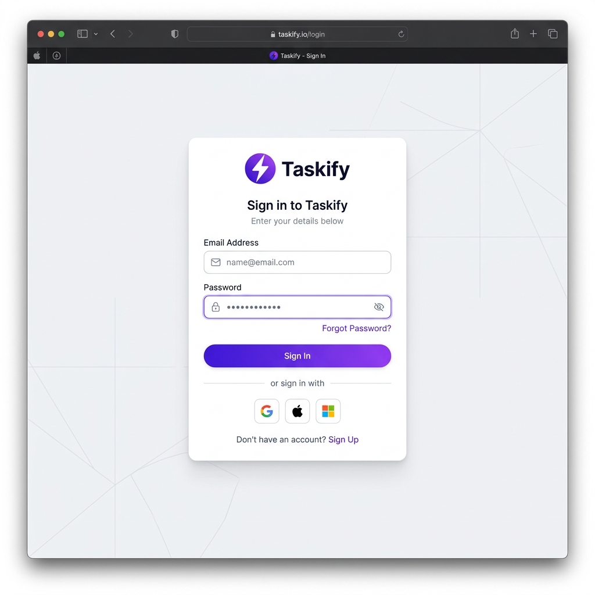

# ⚡ Taskify — Full-Stack Azure CI/CD Implementation

Taskify is a modern, enterprise-grade task management application built with **React**, **Node.js**, and **Azure SQL**.

## 📸 Application Showcase

### 🔐 Secure Login

## 🚀 DevOps & Infrastructure

### 🏗️ Infrastructure Architecture
- **Frontend**: Containerized React App on **Azure App Service**.
- **Backend**: Node.js REST API on **Azure App Service**.
- **Database**: **Azure SQL Database**.
- **Security**: **Azure Key Vault** for secret management.
- **Region**: **Southeast Asia** (Policy Compliant).

## 🛠️ Tech Stack
- **Frontend**: React, Vite, Zustand.
- **Backend**: Node.js, Express, TypeScript, MSSQL.
- **CI/CD**: Azure DevOps YAML Pipelines.
